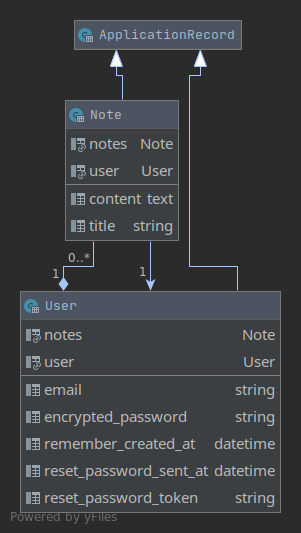

# Connections Portal


[](https://opensource.org/licenses/MIT)

A Ruby on Rails application for organizing and arranging networks, relationships and human connections.

## Deployment

The tested main branch and dev branch are automatically deployed to Heroku when all tests run successfully. 

Further information on the test runs and deployments can be found in the Github-Actions tab.

You can find the currently deployed main version at [https://connections-portal-main.herokuapp.com/](https://connections-portal-main.herokuapp.com/) and the currently deployed dev version at [https://connections-portal-dev.herokuapp.com/](https://connections-portal-dev.herokuapp.com/).

## Generating a Model Class Diagram with RubyMine

RubyMine, an IntelliJ-IDE designed for ruby projects supports generating an uml class diagram from the database scheme. An Instruction can be found here: [https://www.jetbrains.com/help/ruby/creating-diagrams.html#creating-explain-query-plan](https://www.jetbrains.com/help/ruby/creating-diagrams.html#creating-explain-query-plan).
Currently, a file named ```class-diagram.png``` in the projects root folder is linked in this README. So by overwriting this file, or adding a new one to the README, the current model dependencies can be updated.

## Current Model Class Diagram

